# Float-Point


A web application for online judge(algorithm questions), build with MERN stack(MongoDB, Express, React and NodeJs).

## ✨ Features

- 🔗 Separated backend and frontend.
- 🧑‍💻 User-friendly interface for solving and submitting coding problems.
- 📚 Problem management for admins (create, edit, delete problems).
- 🔐 User authentication and role-based access control.
- 📦 Fully containerized with Docker Compose for easy deployment.
- 🖥️ Dedicated Admin Dashboard included

## 🧩 Limitations
- ❗ Currently supports only basic problem types (input/output-based).
- 🔐 Code is not executed inside a secure sandbox; Docker is used, but additional isolation layers (e.g., gVisor, seccomp, AppArmor) are not implemented.
- 🧵 No job queue system (like Redis or RabbitMQ): simultaneous judging requests may cause error.

## 🧱 Project Structure

```
Float-Point/
├── client/              # Frontend (React)
├── admin/               # Admin Dashboard (React)
├── server/              # Backend API (Node.js + Express)
├── judger/              # Automated judging system
├── docker-compose.yml   # Orchestrates services using Docker
├── Dockerfile.*         # Docker configuration for each service
└── README.md
```

## 🛠 Tech Stack

- **Frontend**: React, Tailwind CSS, Axios
- **Admin Dashboard**: React, Tailwind CSS, Axios, TanStack Query
- **Backend**: Node.js, Express.js, MongoDB
- **Judging System**: Node.js, Express.js (no sandbox)
- **Deployment**: Docker, Docker Compose

## ☁️ External Services

This project uses the following third-party services:
- **Cloudinary** — used for storing and managing media assets (images, files, etc.)
- **Mailtrap** — email service for testing and sending emails (e.g., user verification, notifications)

## 🚀 Getting Started

### Requirements

- [Node.js](https://nodejs.org/) (v18 or higher)
- [npm](https://www.npmjs.com/) or [yarn](https://yarnpkg.com/)
- [Docker](https://www.docker.com/) (optional)
- [Docker Compose](https://docs.docker.com/compose/) (optional)

### Setup Instructions

1. **Clone the repository**

    ```bash
    git clone https://github.com/nourist/Float-Point.git
    cd Float-Point
	```

2. **Setting up the environment**
	
	Create a .env file in the `server/`, `client/`, `admin/`, `judger/`  directory and define the necessary environment variables using the following template:

	### Judger Service
	```env
	PORT=             # Port for the Judger service (default 8090)
	```
	### Server Service
	```env
	NODE_ENV=         # Environment for server [production | development] (optional)

 	PORT=             # Port for the Server service (default 8080)

 	CLIENT_URL=       # Frontend URL (default http://localhost:5173)

	ADMIN_URL=        # Admin dashboard URL (default http://localhost:5174)

	JUDGER_URL=       # Judger service URL (default http://localhost:8090)

	JWT_SECRET=       # Secret key for JWT

	HASH_SALT=        # Salt for hashing passwords (set a custom value for security)

	DATABASE_URL=     # MongoDB URL for the database (default mongodb://localhost:27017/FloatPoint | default for docker: mongodb://mongo:27017/FloatPoint)

	MAILTRAP_TOKEN=   # Mailtrap API token (for email testing)

	CLOUD_NAME=       # Cloudinary cloud name

	CLOUD_KEY=        # Cloudinary API key

	CLOUD_SECRET=     # Cloudinary API secret
	```
	### Client Service
	```env
	VITE_API_URL=     # Backend API URL for the client (default http://localhost:8080)
	```
	### Admin Dashboard Service
	```env
	VITE_API_URL=     # Backend API URL (default: http://localhost:8080)
	VITE_CLIENT_URL=  # App client (not Admin Dashboard) (default: http://localhost:5173)
	```

3. **Start services**
	### Manual start

	```bash
	# Judger Service

	cd judger

 	npm i
 	# or
 	yarn
 
	npm run dev
	# or
	yarn dev
	```

	```bash
	# Server Service

	cd server
 
 	npm i
 	# or
 	yarn
 
	npm run dev
	# or
	yarn dev
	```

	```bash
	# Client Service

	cd client
 
 	npm i
 	# or
 	yarn
 
	npm run dev
	# or
	yarn dev
	```

	```bash
	# Admin Dashboard Service

	cd admin
 
 	npm i
 	# or
 	yarn
 
	npm run dev
	# or
	yarn dev
	```

	### Or start services with Docker Compose
	```bash
	docker-compose up --build
	```

4. **Access the application**

	- Open [http://localhost:5173](http://localhost:5173/) in your browser to access Float-Point
	- Open [http://localhost:5174](http://localhost:5174/) in your browser to access Admin Dashboard

## 📸 Screenshots

### Float-point
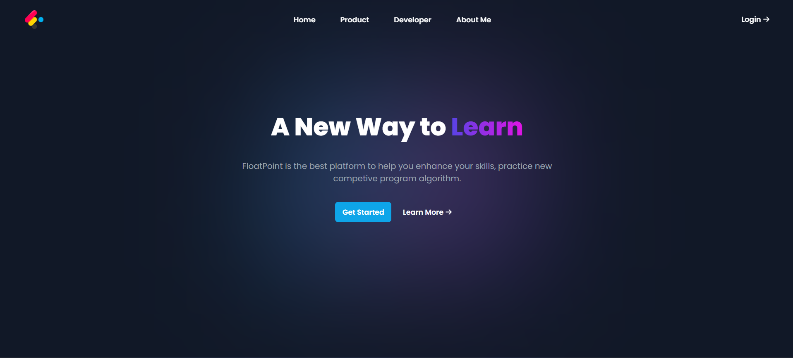
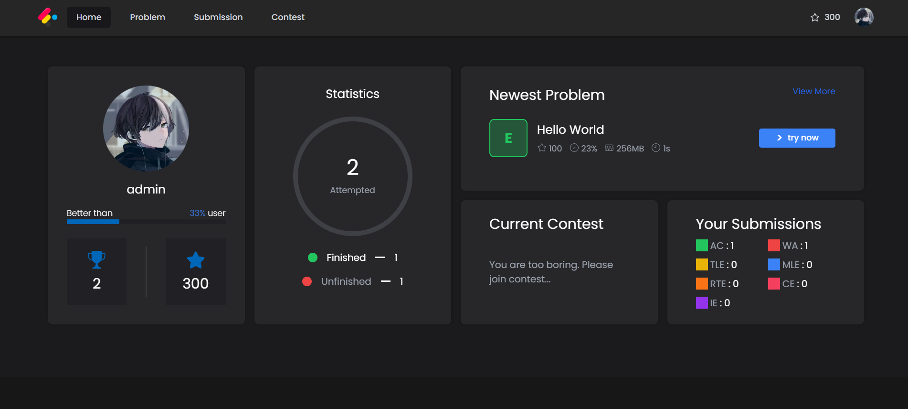
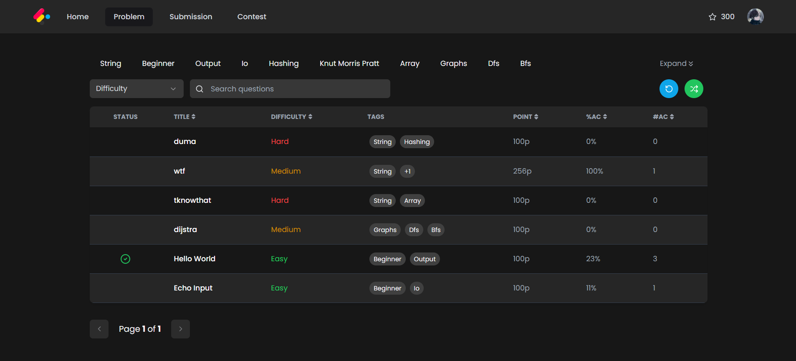
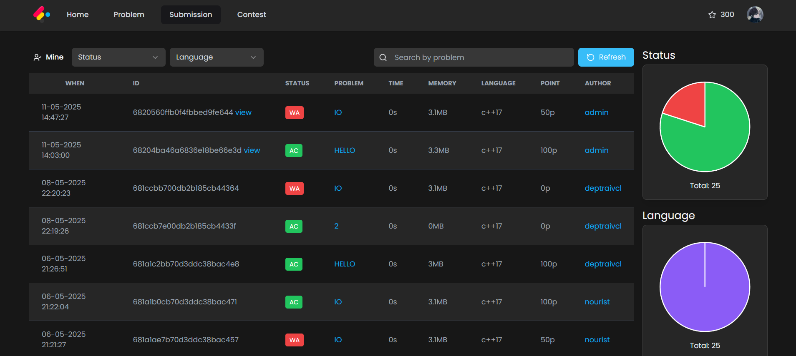
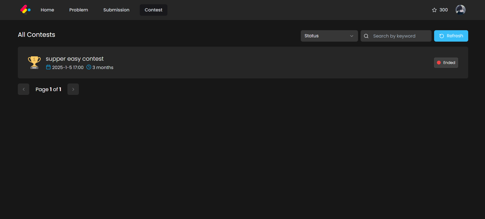

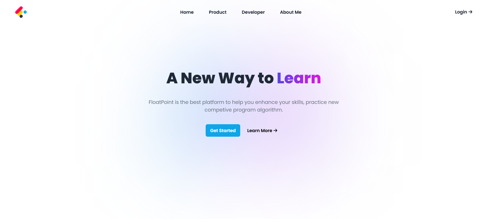
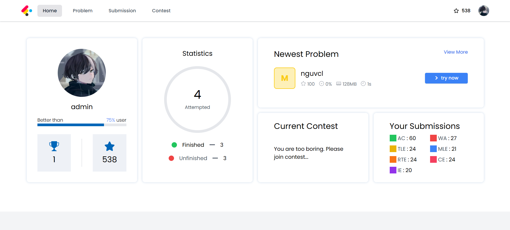
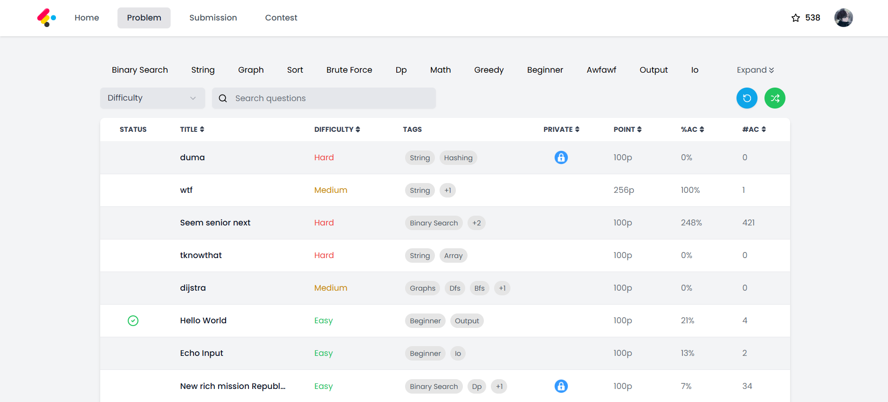
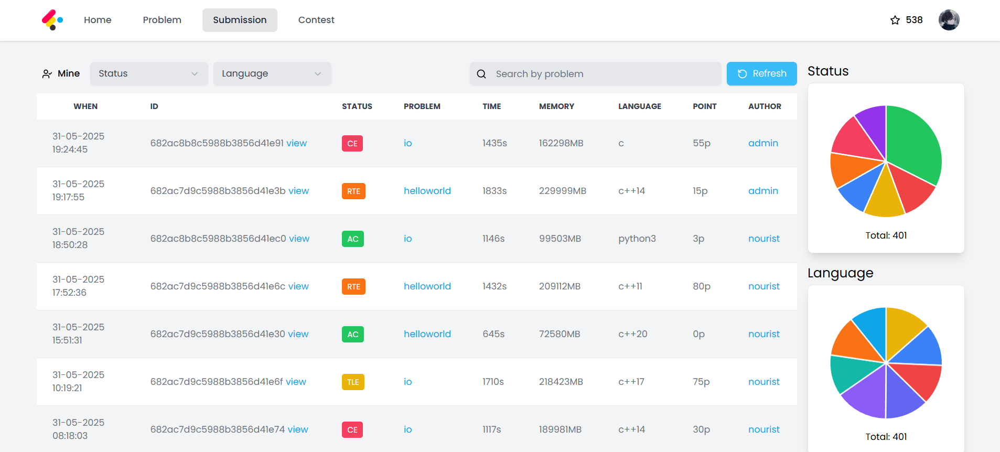
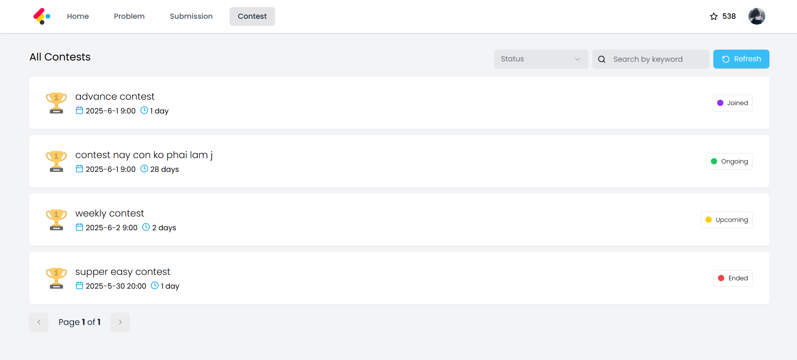

### Admin Dashboard

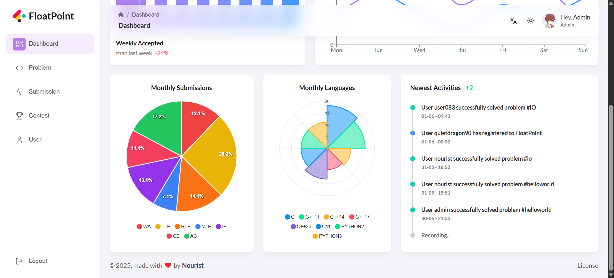
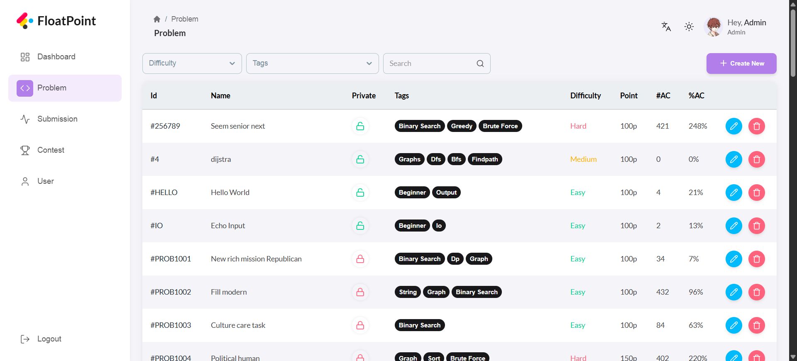
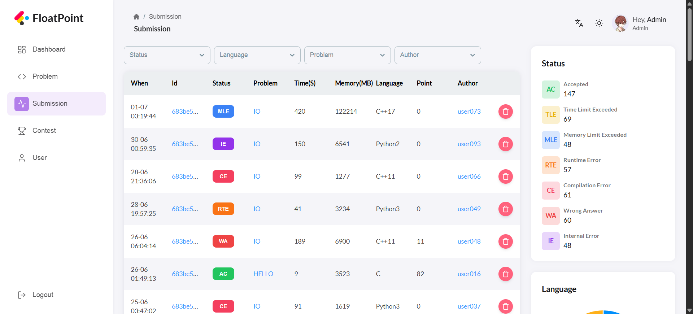


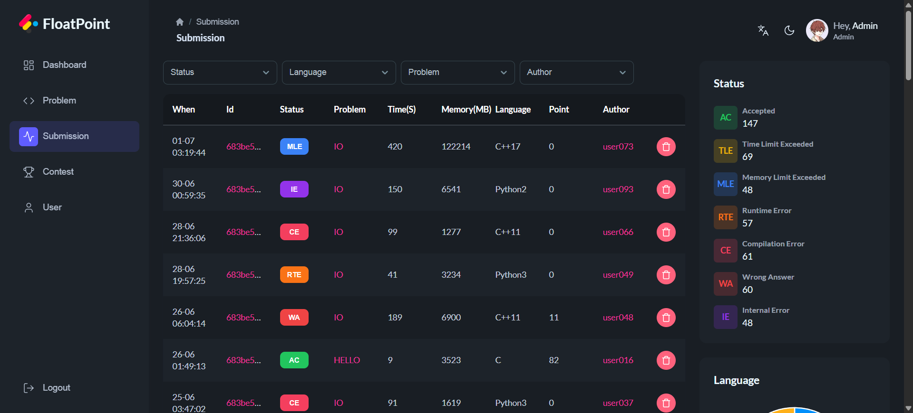
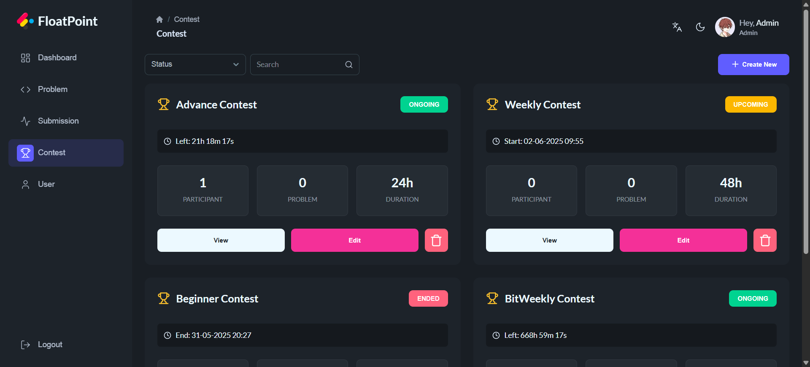


And much more for you to explore...

## 🤝 Contributing
Contributions are welcome! Please feel free to submit a pull request or open an issue for any bugs or suggestions.

## 📄 License
This project is licensed under the [MIT](LICENSE) License.

---
I know that this project still has many bugs and the design is a mess. However, i'm happy with my finall product.

This project is created and maintained by [Nourist](https://github.com/nourist). If you enjoy this tool, feel free to give it a star on GitHub!

```
Sorry for my poor english!
```