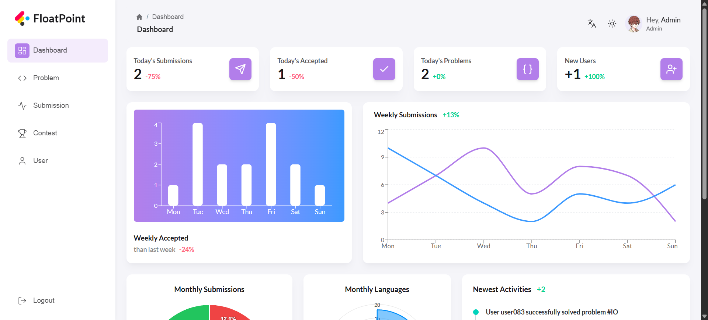
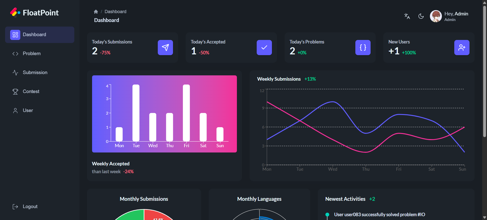
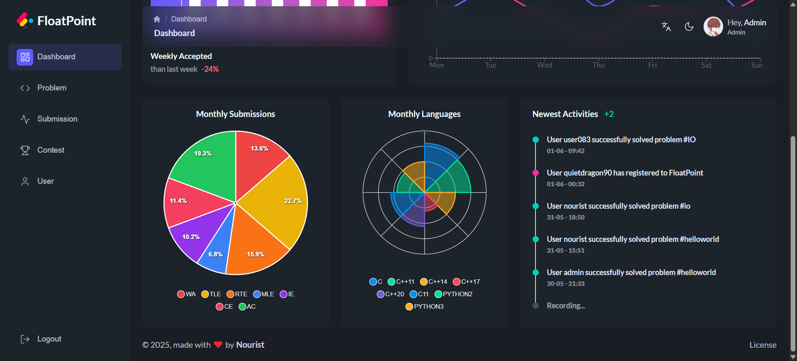
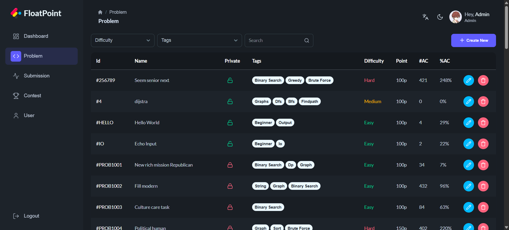
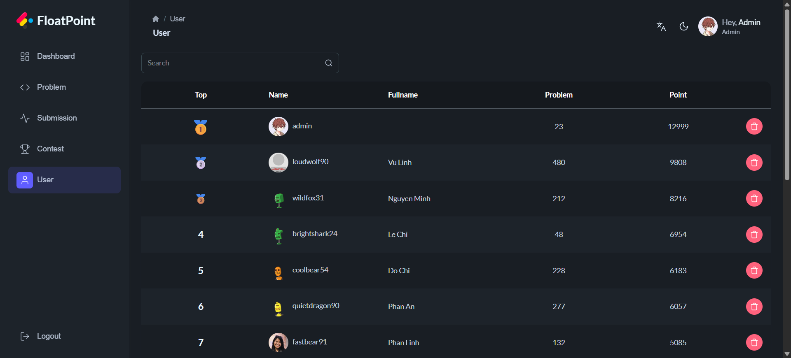

# Float-Point-Admin


Admin dashboard for the Float-Point online judge platform, built with React and modern UI components for powerful platform management.

## ✨ Features

- 🧑‍💻 **User Management** - Manage users, permissions
- 📚 **Problem Management** - Create, edit, delete, and organize coding problems
- 🏆 **Contest Management** - Create and manage programming contests
- 📈 **Submission Analytics** - Track and analyze user submissions
- 🎨 **Modern UI** - Built with Material Tailwind with light and dark theme  
- 🌐 **Multi-language Support** - Internationalization with i18next
- 📱 **Mobile Responsive** - Optimized for all device sizes
- 📊 **Data Visualization** - Charts and graphs with ApexCharts and Recharts

## 🧱 Project Structure

```
Float-Point-Admin/
├── public/             # Static assets
├── src/
|   ├── assets/         # Static assets
│   ├── components/     # Reusable UI components
│   ├── config/         # App config
│   ├── hooks/          # Custom React hooks
│   ├── i18n/           # I18n main module
│   ├── layouts/        # Reusable layouts
│   ├── locales/        # Translation files
│   ├── pages/          # Page components and routes
│   ├── routes/         # App routes
│   ├── services/       # API services and data fetching
│   ├── stores/         # Zustand state management
│   ├── utils/          # Utility functions
│   ├── styles/         # Global styles and Tailwind config
│   ├── App.jsx         # Main application component
│   └── main.jsx        # Main file
├── package.json
├── LICENSE
└── README.md
```

## 🛠 Tech Stack

- **Frontend**: React 19, Vite
- **UI & Styling**: Material Tailwind, Tailwind CSS 4
- **State Management**: Zustand, TanStack Query
- **Data Visualization**: ApexCharts, Recharts
- **Routing**: React Router DOM 7
- **Internationalization**: i18next
- **HTTP Client**: Axios

## 🔗 Related Projects

This admin dashboard is designed to work with:
- **[Float-Point](https://github.com/nourist/Float-Point)** - Main online judge platform

## 🚀 Getting Started

### Requirements

- [Node.js](https://nodejs.org/) (v18 or higher)
- [npm](https://www.npmjs.com/) or [yarn](https://yarnpkg.com/)

### Setup Instructions

1. **Clone the repository**

    ```bash
    git clone https://github.com/nourist/Float-Point-Admin.git
    cd Float-Point-Admin
    ```

2. **Set up environment variables**
	
	Create a `.env` file in the root directory:

	```env
	VITE_API_URL=           # Backend API URL (default: http://localhost:8080/)
	VITE_CLIENT_URL=        # App client (not Admin Dashboard) (default: http://localhost:5173/)
	```

3. **Install dependencies**

    ```bash
    npm install
    # or
    yarn install
    ```

4. **Start the server**
	
	Here *[Float-Point](https://github.com/nourist/Float-Point)*

5. **Start the admin dashboard service**

	```bash
	npm run dev
	# or
	yarn dev
	```

6. **Access the admin dashboard**

	Open [http://localhost:5174](http://localhost:5174/) in your browser.

### Build for Production

```bash
npm run build
# or
yarn build
```

### Preview Production Build

```bash
npm run preview
# or
yarn preview
```

## 📸 Screenshots











And much more for you to explore...

## 🤝 Contributing

Contributions are welcome! Please feel free to submit a pull request or open an issue for any bugs or suggestions.

## 📄 License

This project is licensed under the [MIT](LICENSE) License.

---

This admin dashboard provides a powerful management interface for the Float-Point online judge platform, enabling administrators to efficiently manage users, problems, contests, and monitor platform analytics.

This project is created and maintained by [Nourist](https://github.com/nourist). If you enjoy this tool, feel free to give it a star on GitHub!
